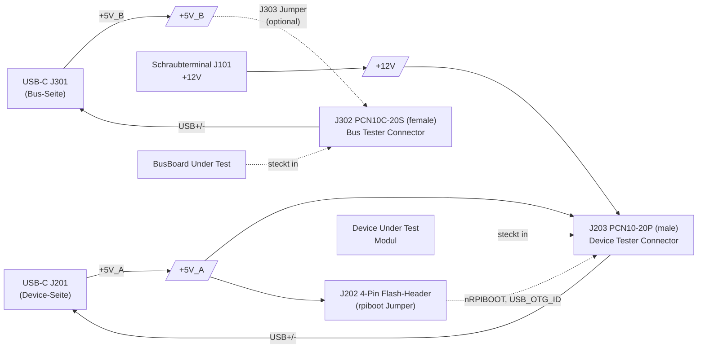

# Device Tester PCB

<table>
  <tr><th>Top</th><th>Bottom</th></tr>
  <tr>
    <td></td>
    <td></td>
  </tr>
</table>

## Übersicht

Universelles Bringup- und Test-Board für alle OE5XRX-Hardware-Module. Es hat zwei voneinander unabhängige Steckverbinder-Seiten und kombiniert sie mit USB-C-PC-Anschlüssen, einer +12V-Schraubterminal-Quelle und einem 4-Pin-Flash-Header für CM4-rpiboot:

- **Device-Tester-Seite** (`J203`, männlicher PCN10-Stecker — wie ein BusBoard-Slot): Hier wird ein zu testendes Modul (PowerBoard, CM4Carrier, FM-Transceiver etc.) eingesteckt. Das Modul wird vom DeviceTester aus mit Strom versorgt — USB-C `J201` bringt +5V_A; Phoenix-Schraubterminal `J101` bringt +12V (für Module die echte +12V brauchen, z.B. FM-Modul mit SA818-TX-Spitzen).
- **Bus-Tester-Seite** (`J302`, weibliche PCN10C-Buchse — wie ein Modul): Hier wird ein zu testendes BusBoard angesteckt. USB-C `J301` bringt +5V_B und kann über Jumper `J303` an die Bus-Tester-Seite durchgereicht werden, sodass das BusBoard ohne eigenes PowerBoard betrieben werden kann.
- **CM4 flashen**: Über den 4-Pin Flash-Header `J202` werden die beiden Bus-Pins `nRPIBOOT` und `USB_OTG_ID` manuell per Jumper auf die richtigen Pegel gezogen — siehe ["CM4 flashen"](#cm4-flashen) unten.

Die zwei +5V-Rails (`+5V_A` Device-Seite, `+5V_B` Bus-Seite) sind elektrisch entkoppelt, damit kein Backfeed zwischen den Test-Kontexten passiert.

## Block-Diagramm

## Steckverbinder

| Bezeichner | Typ | Funktion |
| ---------- | --- | -------- |
| **J101** | Phoenix MKDS-1,5-2 5.08 mm Schraubterminal (2-Pin) | +12V-Eingang. Nötig für Module die echte +12V brauchen (z.B. SA818-TX). |
| **J201** | USB-C 2.0 (G-Switch GT-USB-7010ASV) | Device-Seite. +5V_A-Versorgung und USB-Datenanschluss für den DUT in `J203`. |
| **J202** | 4-Pin Stiftleiste 2.54 mm | Flash-Header: GND / nRPIBOOT / USB_OTG_ID / +5V_A. Silkscreen-beschriftet. |
| **J203** | Hirose **PCN10-20P-2.54DS** (männlich, 2×10) | "Device Tester Connector" — Slot in den der DUT eingesetzt wird. Pinbelegung entspricht der BusBoard-Slot-Seite. |
| **J301** | USB-C 2.0 (G-Switch GT-USB-7010ASV) | Bus-Seite. +5V_B-Versorgung und USB-Datenanschluss für eine angeschlossene BusBoard. |
| **J302** | Hirose **PCN10C-20S-2.54DS** (weiblich, 2×10) | "Bus Tester Connector" — Buchse die in einen BusBoard-Slot gesteckt wird. Pinbelegung wie ein normaler Modul-Stecker. |
| **J303** | 2-Pin Stiftleiste 2.54 mm | Jumper: schließt `+5V_B` auf die `+5V`-Pins von `J302`. Bei externer Bus-Versorgung **offen** lassen. |

## Versorgung (drei Rails)

| Rail | Quelle | Funktion | Status-LED |
| ---- | ------ | -------- | ---------- |
| **+12V** | Schraubterminal `J101` | Speist den DUT in `J203` (+12V-Pins des PCN10-Steckers) | `D101` |
| **+5V_A** | USB-C `J201` (VBUS) | Speist `J203` (+5V-Pins) und `J202` Pin 4. Auch USB-Daten zum DUT laufen über `J201`. | `D201` |
| **+5V_B** | USB-C `J301` (VBUS) | Speist `J302` (+5V-Pins) **nur wenn Jumper `J303` geschlossen**. USB-Daten zur BusBoard laufen über `J301`. | `D301` |

Hinweis: `+12V` (`J101`) und `+5V_A` (`J201` VBUS) sind unabhängige Quellen. Beide können zusammen oder einzeln versorgt werden — der DUT zieht aus jeder Quelle was er braucht.

## CM4 flashen

Der CM4-Carrier hat keinen eigenen rpiboot-Jumper — beide Steuersignale (`nRPIBOOT` und `USB_OTG_ID`) sind auf den Bus-Stecker geführt. Hier am DeviceTester werden sie über den 4-Pin Flash-Header `J202` manuell per Jumper auf die korrekten Pegel gezogen:

| Pin | Signal |
|----:|--------|
| 1 | GND |
| 2 | `nRPIBOOT` (geht via `J203 b2` zum CM4) |
| 3 | `USB_OTG_ID` (geht via `J203 b3` zum CM4) |
| 4 | +5V_A |

Jumper-Konfiguration für rpiboot-Mode:

- **Pin 1 ↔ 2** (GND ↔ nRPIBOOT) — versetzt den CM4 nach Power-Up in den USB-Boot-Modus.
- **Pin 3 ↔ 4** (USB_OTG_ID ↔ +5V_A) — schaltet die CM4-USB-Schnittstelle in den Device-Mode (PC = Host, CM4 = Peripheral).

Ablauf:

1. CM4 in den [CM4-Carrier](../HW-Module-CM4Carrier/) einsetzen, Carrier in den DeviceTester `J203` einstecken.
2. Beide Jumper auf `J202` setzen (1↔2 + 3↔4).
3. `J201` USB-C mit dem PC verbinden.
4. `rpiboot` auf dem PC starten — der CM4 erscheint als USB-Mass-Storage-Device (eMMC-Variante).
5. Nach dem Flashen: **beide Jumper wieder abziehen**, sonst bleibt der Carrier beim nächsten Power-Up im rpiboot-Mode hängen statt regulär zu booten.

## Test-Workflows

### 1. DUT-Test (Standalone-Modul-Bringup)

Use Case: ein einzelnes Modul (z.B. FM-Transceiver oder PowerBoard) **ohne** vollständige Remote-Station-Umgebung testen oder debuggen.

1. Modul in `J203` (Device Tester Connector) einsetzen.
2. +12V an `J101` anschließen falls das Modul +12V braucht (z.B. FM-Transceiver wegen SA818).
3. `J201` USB-C mit dem PC verbinden — versorgt das Modul mit +5V_A und macht dessen USB-Datenleitungen am PC sichtbar.
4. Tests/Bringup wie in der Doku des jeweiligen Moduls beschrieben (siehe `Bringup`-Sektionen der Modul-Docs).

### 2. CM4 flashen (rpiboot)

Siehe Sektion ["CM4 flashen"](#cm4-flashen) oben.

### 3. BusBoard-Test ohne eigene Versorgung

Use Case: eine BusBoard testen ohne komplettes PowerBoard angeschlossen zu haben — der DeviceTester speist das BusBoard direkt aus USB-C.

1. DeviceTester via `J302` (Bus Tester Connector — die weibliche Buchse) in einen freien Slot der zu testenden BusBoard stecken.
2. **`J303` Jumper schließen** — verbindet `+5V_B` mit den `+5V`-Pins von `J302`, sodass das BusBoard aus dem USB-C versorgt wird.
3. `J301` USB-C mit dem PC verbinden.
4. Falls das BusBoard ihr eigenes PowerBoard hat → `J303` Jumper **offen** lassen, sonst gibt's Backfeed-Risiko zwischen den zwei +5V-Quellen.

## Bringup des DeviceTester selbst

Nach Bestückung:

1. **+12V-Sanity:** Strombegrenztes Labornetzgerät (12 V / 100 mA) an `J101` anschließen → `D101` muss leuchten. Strom < 5 mA erwartet (nur LED + ihre Vorwiderstände).
2. **+5V_A-Sanity:** USB-C-Kabel an `J201` und einen USB-Host (PC oder Powerbank) → `D201` muss leuchten.
3. **+5V_B-Sanity:** USB-C-Kabel an `J301` → `D301` muss leuchten.
4. **+12V am DUT-Konnektor:** zwischen `J203`-Pins messen — die +12V-Pins müssen die Eingangsspannung zeigen.
5. **+5V_B-Isolation:** `J303` offen, `J301` versorgt — zwischen `J302`-Pin-+5V und GND messen → muss **0 V** zeigen. `J303` schließen → +5V_B muss durchschlagen.

## Verwandte Module

- [BusBoard](../HW-Module-BusBoard/) — kann via Bus-Tester-Seite (`J302`) ohne eigenes PowerBoard getestet werden.
- [CM4 Carrier](../HW-Module-CM4Carrier/) — wird via Device-Tester-Seite (`J203`) geflasht; rpiboot-Logik im DeviceTester (`J202`).
- [PowerBoard](../HW-Module-PowerBoard/) — kann standalone via Device-Tester-Seite (`J203` + Phoenix `J101` für +12V) getestet werden.
- [FM Transceiver](../HW-Module-FMTransceiver/) — Standalone-Bringup via Device-Tester-Seite (braucht beide Quellen: USB-C für USB + +5V, Phoenix für +12V).

## Daten

- [Schaltplan]({{ site.data.project.name }}-schematic.pdf)
- [BOM]({{ site.data.project.name }}-bom.html)
- [iBOM]({{ site.data.project.name }}-ibom.html)
- [JLCPCB fabrication & stencil](JLCPCB/{{ site.data.project.name }}-_JLCPCB_compress.zip)
- [JLCPCB Bom](JLCPCB/{{ site.data.project.name }}_bom_jlc.csv)
- [JLCPCB Pick&Place](JLCPCB/{{ site.data.project.name }}_cpl_jlc.csv)
